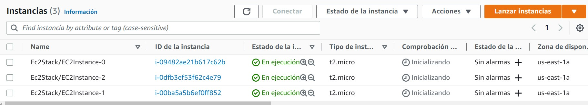

# Despliegue de aplicación en multiples instancias de EC2

Este proyecto contiene una aplicación desarrollada en Vue js y el desarrollo de CDK con TypeScript.

El CDK crea tres instancias EC2 en AWS, estas instancias estan ligadas a la VPC por defecto de la cuenta asociada. 

La llave asociada, el grupo de seguridad y el rol que son utilizados para la creación de las instancias pueden ser creados en el proceso, o pueden utilizar recursos ya creados en AWS. Para utilizar recursos ya creados es necesario configurar las variables de entorno como se muestra a continuación.
```
SECURITY_GROUP_ID
KEY_PAIR_NAME
ROLE_ARN
```
Adicionalmente, es necesario comentar y/o descomentar código en el archivo ec2-stack.ts dependiendo del si se busca utilizar recursos existententes o crear nuevos. 

Actualmente el CDK esta preparado para utilizar una llave y un rol ya existentes en AWS y crear el grupo de seguridad con los puertos 22 y 8081 abiertos, el puerto 22 para realizar conexiones SSH y el puerto 8081 para exponer la aplicacion de Vue.

A las instancias se le pasaron datos de usuario, los cuales ejecutan los comandos para el despliegue de la aplicación a través de docker. Estos comandos se encargan de actualizar la instancia, instalar docker y git, clonar el repositorio, compilar la imagen y subir el contenedor.

Para ejecutar el CKD primero agregue las variables de entorno que indican la cuenta y la region en AWS
```
AWS_ACCOUNT
AWS_REGION
```
Posteriormente ejecute el comando `cdk deploy`, al finalizar podra ver una respuesta como la que se muestra a continuación


Al finalizar el despliegue puede acceder a la consola de AWS, donde debe ver tres instancias corriendo


Para acceder a la aplicación utilice el DNS público de cada una de las instancias. En el puerto 8081 podra ver la aplicación corriendo

